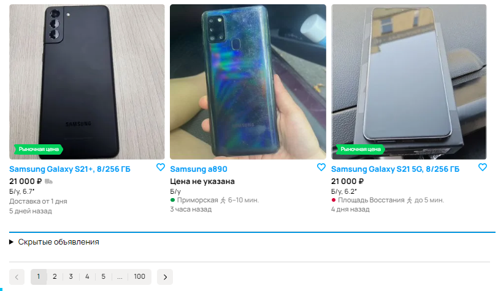

## Расширение Ave Blacklist

Расширение создано для того, чтобы скрывать объявления нежелательных продавцов на Авито (Avito) - спамеров, агентств продаж и так далее.

Чат для пользователей расширения: https://t.me/+awLSBtmtzCRmZDYy  
Инструкция по использованию расширения: https://docs.google.com/document/d/1-c-i8uzRbrpEL9QxFl5TW9ONoFoN2DRWlC7c0RnrBlQ/edit?usp=sharing

Ускорить выход новых функций, а также поддержать автора можно по ссылкам:  
Юмани: https://yoomoney.ru/to/410017049190008  
Paypal: https://paypal.me/givememoneypls777?country.x=RU&locale.x=ru_RU  
Перевести на карту: `5536 9138 1038 8344`  